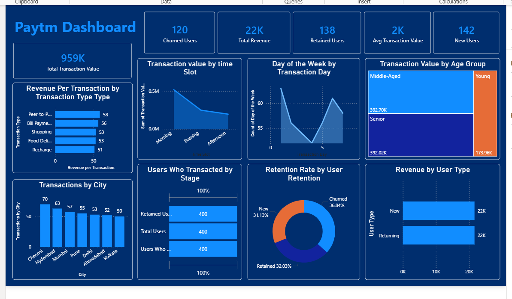

# paytm-analytics-dashboard
Built an interactive Paytm Analytics Dashboard using Power BI, Python, SQL, and Excel. Analyzed user retention, churn, revenue, transaction value, and customer behavior across cities, age groups, and transaction types. Developed dynamic KPIs and visualizations to identify business trends and improve customer engagement strategies.
# Paytm User & Transaction Analytics Dashboard

## Project Overview
This project presents an interactive analytics dashboard built to analyze user behavior, transaction performance, revenue trends, customer retention, and churn metrics. The dashboard helps identify business patterns and provides actionable insights for improving customer engagement and transaction growth.

## Tools & Technologies
- Power BI
- Python
- Pandas
- NumPy
- SQL
- Excel

## Key Features
- Revenue and Transaction Analysis
- User Retention & Churn Tracking
- New User Growth Monitoring
- Transaction Type Analysis
- City-wise Performance Analysis
- Age Group Segmentation
- Interactive Filters and KPIs

## Dashboard Metrics
- Total Revenue
- Total Transaction Value
- New Users
- Retained Users
- Churned Users
- Transaction Count
- Customer Retention Rate

## Key Insights
- Identified high-performing transaction categories.
- Analyzed customer retention and churn trends.
- Compared transaction performance across cities.
- Evaluated user activity by age groups.
- Tracked revenue growth and transaction volume over time.

## Dashboard Preview

### Overview Dashboard


## Project Structure

```
Paytm-Analytics-Dashboard/
│
├── Dashboard.pbix
├── dashboard.png
└── README.md
```

## Skills Demonstrated
- Data Cleaning
- Data Analysis
- SQL Querying
- KPI Reporting
- Business Intelligence
- Dashboard Development
- Data Visualization
- Customer Analytics

## Author
Ghanshyam Rajput
